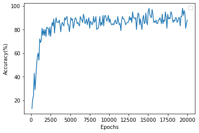
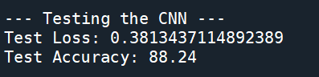

<h2>CNN is applied along with MLP to classify images in MNIST dataset.</h2>

<h3>Output</h3>
<ol>
	<li>Training Accuracy and loss</li>
	
	<li>Accuracy vs Epoch graph</li>
	
	<li>Test Accuracy and loss</li>
	
</ol>